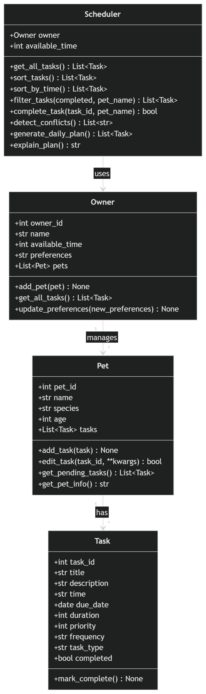
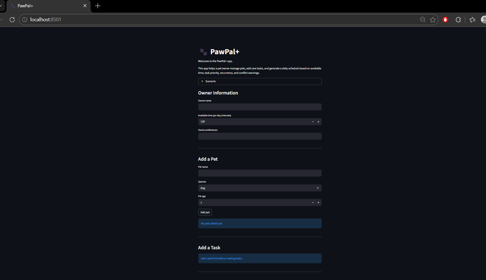

# PawPal+ (Module 2 Project)

You are building **PawPal+**, a Streamlit app that helps a pet owner plan care tasks for their pet.

## Scenario

A busy pet owner needs help staying consistent with pet care. They want an assistant that can:

- Track pet care tasks (walks, feeding, meds, enrichment, grooming, etc.)
- Consider constraints (time available, priority, owner preferences)
- Produce a daily plan and explain why it chose that plan

Your job is to design the system first (UML), then implement the logic in Python, then connect it to the Streamlit UI.

## What you will build

Your final app should:

- Let a user enter basic owner + pet info
- Let a user add/edit tasks (duration + priority at minimum)
- Generate a daily schedule/plan based on constraints and priorities
- Display the plan clearly (and ideally explain the reasoning)
- Include tests for the most important scheduling behaviors

## Getting started

### Setup

```bash
python -m venv .venv
source .venv/bin/activate  # Windows: .venv\Scripts\activate
pip install -r requirements.txt
```

### Suggested workflow

1. Read the scenario carefully and identify requirements and edge cases.
2. Draft a UML diagram (classes, attributes, methods, relationships).
3. Convert UML into Python class stubs (no logic yet).
4. Implement scheduling logic in small increments.
5. Add tests to verify key behaviors.
6. Connect your logic to the Streamlit UI in `app.py`.
7. Refine UML so it matches what you actually built.

## Smarter Scheduling

PawPal+ now includes several smarter scheduling features to make pet care planning more useful and realistic:

- Sorting by time:Tasks can be ordered by due date and time so the schedule appears in a logical sequence.
- Filtering:Tasks can be filtered by pet name or completion status to make it easier to focus on relevant items.
- Recurring tasks: When a daily or weekly task is completed, the system automatically creates the next occurrence.
- Conflict detection:The scheduler can detect when two tasks are scheduled for the same date and time and return a warning message.


## Testing PawPal+

To run the automated test suite, use:

```bash
python -m pytest

### What is tested

The test suite verifies the core functionality of the PawPal+ system, including:

-Task completion updates the task status correctly
-Tasks can be added to pets
-Tasks are sorted correctly by date and time
-Recurring tasks (daily and weekly) generate the next occurrence
-Conflict detection identifies tasks scheduled at the same time

### Confidence Level

⭐⭐⭐⭐☆ (4/5)

I am confident that the system behaves correctly for the main scheduling features and common edge cases. The tests cover sorting, filtering, recurring tasks, and conflict detection. Additional improvements could include testing more complex scheduling scenarios such as overlapping durations or large task sets.

## System Architecture (UML)



## Features

- Add and manage multiple pets
- Add, edit, and complete pet care tasks
- Task prioritization based on importance
- Sorting tasks by date and time
- Filtering tasks by pet and completion status
- Daily schedule generation based on available time
- Recurring tasks (daily and weekly automation)
- Conflict detection for tasks scheduled at the same time
- Clear schedule explanation for decision transparency

## 📸 Demo
Below is a screenshot of the PawPal+ application interface showing task management, scheduling, and conflict detection features.

